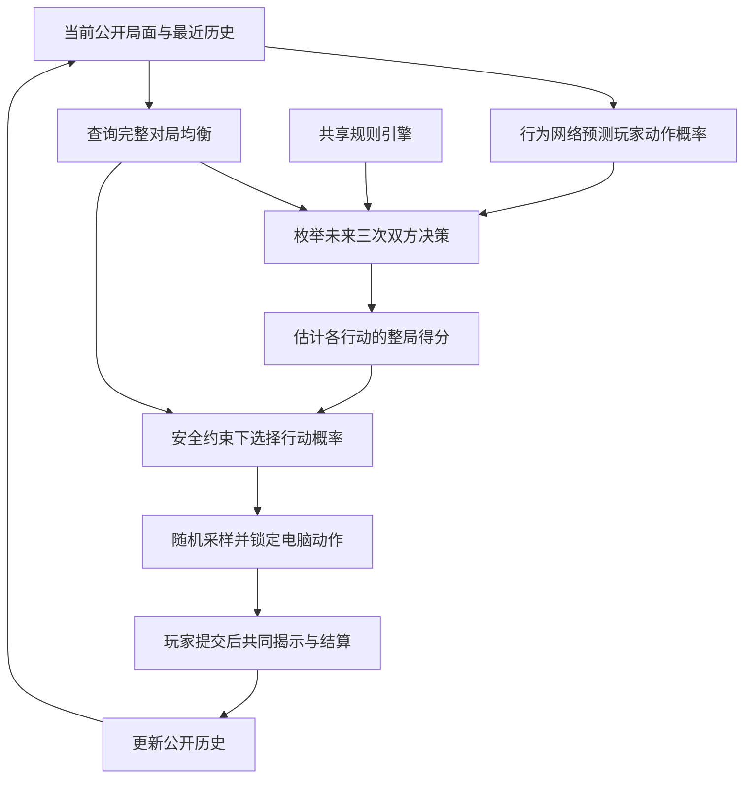

# 西部牛仔：完整模式 AI 模型说明

原版说明：`full-temporal3-v1` / `v0.14.0` · 整理日期：2026-09-26

**v0.15.0 更新**：网页策略升级为 `full-temporal3-credit-v1`，网络、特征和三步规划保留；第 7.1 节描述的逐步固定限额改为动态整局余额。每局从 0.0199 开始，公开玩家动作后以整个已锁定分布更新余额，跨轮保留、新局重置，安全上界约 0.019900050504。原记忆兼容；新增可手动导出的决策诊断。最新运行方式、证据和暂缓的实验见 [发布说明](RELEASE_AI_V0_15.md)。以下保留原版建模说明及当时实验结果，不将旧阶段成绩冒充本次发布成绩。

本文描述本次接入网页的实际模型。用户已确认部署成功；算法与实验数字依据本地发布代码和第五阶段研究结果核对。早期研究方案与当前实现存在差别，本文以当前实现为准。

## 1. 我们最终建立了什么

电脑采用一套组合决策模型：**用完整对局均衡提供基线，用小型神经网络预测玩家行为，再通过三步规划和安全约束决定行动概率。**

这套模型同时负责每轮初始选弹和轮内开枪、防御、装弹。它评价一个行动时，会考虑双方筹码、初始选弹产生的赔付倍数、剩余轮数，以及对玩家打法的观察。

四个部分各有分工：

| 部分 | 回答的问题 | 实现方式 |
| --- | --- | --- |
| 规则引擎 | 双方这样行动之后，子弹、筹码和轮次怎么变化？ | 使用游戏共享规则直接计算 |
| 完整对局均衡 | 面对最会针对自己的对手，这个局面还能保住多少整局得分？ | 离线动态规划与小矩阵博弈求解 |
| 行为预测网络 | 根据已公开的历史，玩家下一手更可能做什么？ | 小型全连接神经网络 |
| 安全规划器 | 怎样利用玩家习惯，同时限制被反制的风险？ | 三步前瞻、受约束的概率优化、随机采样 |

神经网络承担的是难以逐条手写的行为预测。胜负规则、赔付公式、筹码变化和合法动作仍然按规则计算。

## 2. 优化目标是整局结果

模型从电脑视角评价完整一局：

\[
R=\begin{cases}
1,&\text{电脑赢得整局}\\
0.5,&\text{整局平局}\\
0,&\text{电脑输掉整局}
\end{cases}
\]

目标是提高期望得分：

\[
\mathbb E[R]=P(\text{胜})+0.5P(\text{平}).
\]

中间某轮获胜不会直接得到额外奖励；它先引起筹码结算，再影响后续局面和最终结果。电脑也不会为了多拿子弹、拖长游戏或使用某个动作而得到人为奖励。完整模式的时间折扣为 1。

因此，当前轮更容易获胜的动作，未必具有最高整局价值。例如，两种打法都可能赢下这一轮，但结算子弹差、赔付倍数不同，对最终筹码的影响也不同。

实验分别报告胜率、平率、负率和平均得分。后文实验的胜率以全部对局为分母；网页菜单目前按“胜 /（胜＋负）”显示玩家胜率，并单列平局，两种统计口径要区分。

## 3. 电脑看见的局面

基础状态保存：

\[
s=(\text{阶段},\text{轮数},\text{轮内回合},
\text{双方筹码},\text{双方初始子弹},\text{双方当前子弹}).
\]

另加玩家行为上下文：上一回合双方动作、上一轮结果，以及最近的公开事件历史。

| 状态 | 取值或意义 |
| --- | --- |
| 阶段 | 初始选弹，或轮内出招 |
| 轮数 | 第 1～5 轮 |
| 轮内回合 | 第 1～100 回合 |
| 筹码 | 双方分别保存，初始各 50 |
| 初始子弹 | 双方本轮各选 0、1、2 颗 |
| 当前子弹 | 随出招变化，最多 10 颗 |
| 上一回合动作 | 双方最近一次公开的轮内动作 |
| 上一轮结果 | 从电脑视角记录胜、平、负 |

双方筹码必须保留绝对值。50 对 50 和 10 对 10 的差额都是 0，但触发筹码归零、提前结束的风险不同，不能当成同一个状态。

赔付由本轮初始选弹与结算时的子弹差共同决定。令双方初始子弹为 \(i,j\)，结算终弹差为 \(x\)：

\[
y=(i+1)(j+1)x.
\]

非平局时，终弹较多的一方获胜，转移 \(y\)；终弹较少的一方获胜，转移 \(2y\)。这里的“劣势”按结算终弹判断，不是按筹码或初始子弹判断。终弹差为 0 时不转移筹码；平局时双方各扣 \(5\times\text{自己的初始子弹}\)。

例如，同样终弹相差 2 颗，双方初始都选 0 时基础赔付为 2；都选 2 时基础赔付为 18。这样的差别直接进入后续价值计算。

瞬间击中装弹时，结算终弹会扣除开枪消耗的子弹，被击中的装弹不增加子弹。完整模式调用专门的终弹结算函数，避免拿快速模式用于显示的瞬间胜负子弹数直接算钱。

## 4. 完整对局均衡：整局价值的基线

均衡模型假设对手会选择对电脑最不利的策略。每个状态都形成一个至多 \(3\times3\) 的矩阵：行是电脑动作，列是玩家动作，矩阵元素是这一对动作之后的整局延续价值。

\[
Q_{\rm eq}(s,a,b)=
\begin{cases}
R,&\text{行动后整局结束},\\
V_{\rm eq}(s'),&\text{行动后继续到状态 }s'.
\end{cases}
\]

一轮结束时，先结算筹码，再进入下一轮选弹。通过有限时域倒序求解，把第五轮的终局结果一路传回第一轮选弹。

电脑的均衡价值为：

\[
V_{\rm eq}(s)=\max_p\min_b\sum_a p_aQ_{\rm eq}(s,a,b).
\]

这里的 \(p\) 是行动概率分布。选弹和出招都按同时行动处理，不允许观察玩家本次选择之后再针对性选择。

这份基线覆盖完整筹码对局，独立于快速模式策略表。离线使用 Python、NumPy、SciPy 建立与核对求解结果；网页运行时使用导出的价值表和 Node.js 小矩阵求解器。

均衡不保证每一局都赢。它提供的是在规则模型内、面对最佳反制时的期望得分基线。识别玩家习惯之后，电脑可以在安全范围内偏离均衡，争取额外收益。

## 5. 神经网络：预测玩家下一手

### 5.1 网络结构

固定网络结构为：

\[
203\text{ 维输入}\rightarrow96\text{ 个隐藏单元，tanh}
\rightarrow3\text{ 个输出}\rightarrow\text{合法动作 softmax}.
\]

共有 **19,875 个参数**。发布权重使用 float64 保存，原始文件为 **159,000 字节**。

同一网络处理两个阶段：选弹时，三个输出代表选 0、1、2 颗；出招时，代表开枪、防御、装弹。阶段信息包含在输入中。非法动作会被屏蔽，例如无子弹时玩家的开枪概率为 0。

网络给出的首先是**玩家**的行动概率。电脑如何行动，还要经过后面的规则推演和安全优化。

### 5.2 输入包含什么

| 输入组 | 维数 | 内容 |
| --- | ---: | --- |
| 当前状态与均衡信息 | 19 | 阶段、轮次、回合、双方筹码与子弹、上一轮结果、上一回合双方动作、玩家均衡动作概率 |
| 最近 8 次公开事件 | 88 | 每次 11 维，保留较近的动作顺序与轮、局边界 |
| 最近 64 次事件的延迟统计 | 96 | 玩家对电脑或自己过去 1～4 手动作的条件响应频率，以及对应样本量信息 |
| 合计 | **203** | |

每个公开事件包含：有效标记、是否选弹、双方行动的独热编码、是否轮末、是否局末，以及该轮结果。没有事件的位置用零补齐。

延迟统计帮助网络识别“电脑开枪后，玩家隔两手倾向装弹”“玩家自己的某个动作之后，会按一定顺序继续行动”等时序关系。它先提供可核对的历史统计，再由网络学习这些统计与筹码、子弹、轮次之间的组合关系。

具体统计使用加一平滑：某个条件下动作出现 \(n_b\) 次、总观察 \(N\) 次，则频率特征为 \((n_b+1)/(N+3)\)，另输入 \(N/(N+3)\) 表达证据数量。这样一次偶然行动不会直接被编码成没有不确定性的绝对规律。

网络是带历史特征的全连接网络，没有循环隐藏状态，也不是 Transformer。当前结构保留了明确的历史窗口，便于运行和检查。

### 5.3 什么信息不能输入

输入只使用已公开的游戏信息。玩家本回合尚未揭示的动作、合成玩家的真实类型、隐藏参数和真实行动概率都不作为决策输入。

网络学习的是条件概率，不会被直接告知“这个玩家属于某种类型”。它也无法保证识别训练范围以外的所有真人打法。

## 6. 三步规划：把预测转成电脑行动

有历史之后，电脑从当前状态枚举未来三次双方决策。“一步”可以是一次选弹，也可以是一次轮内出招；如果途中结束一轮，搜索会结算筹码并进入下一轮。

对每个候选电脑动作，搜索会：

1. 预测玩家在当前模拟局面的合法动作概率。
2. 枚举玩家动作，并按规则计算所有后续状态。
3. 把模拟中双方已经揭示的动作加入该分支历史，再预测更后面的玩家行为。
4. 在后续节点继续选择满足安全约束的电脑策略。
5. 三步以内到达整局终点时，使用胜、平、负的实际得分；搜索深度用完时，使用完整对局均衡价值评价剩余局面。

因此，搜索中既推进子弹和筹码，也推进历史。它可以考虑“这一步公开之后，下一步我们会掌握哪些新信息”，以及玩家可能怎样回应电脑此前的动作。

叶节点的均衡价值让三步搜索仍然评价整局结果。例如，第五轮即将结束时的筹码优势，与第一轮同样子弹状态的价值可能很不同。

不过，三步之后的对手适应主要由均衡延续价值近似。当前算法没有展开到整局末尾的完整玩家信念树，也没有实现完整贝叶斯 MCTS。不能据此宣称已经找到针对未知真人的全局最优策略，或完整计算了所有未来信息价值。

## 7. 安全约束与随机性

### 7.1 在安全范围内利用对手

规划给各电脑动作估计得分 \(\widehat Q_a\)。当前发布版在可行概率分布中最大化：

\[
\max_p\sum_a p_a\widehat Q_a.
\]

除概率非负、总和为 1 外，还要求对玩家的每个合法动作 \(b\)：

\[
\sum_a p_aQ_{\rm eq}(s,a,b)
\ge V_{\rm eq}(s)-\delta,
\qquad\delta=\frac{0.0199}{505}
\approx0.00003940594.
\]

505 来自最多五次选弹加 500 次轮内出招。它把整局可用的偏离预算分配到每个决策，避免每回合都允许损失 0.02 而在整局积累过多风险。

当前均衡表记录的累计误差上界约为 \(3.87\times10^{-12}\)。再计入每步 \(10^{-11}\) 的数值容差，预算检查约为：

\[
505(\delta+10^{-11})+3.87\times10^{-12}
\approx0.019900005054<0.02.
\]

该限制针对的是：**相对完整对局均衡价值，整局最坏情况期望得分的下降预算**。它不等于“实际胜率最多下降两个百分点”，也不保证对每一种固定弱对手都只比均衡少拿 0.02 分。网络预测错误仍可能使电脑错过本来可以利用的机会。

这项界限依赖当前规则、合格的均衡表和每次实际行动都通过约束检查，不把网络预测正确当作前提。规则或结算变化后，必须重新生成并验证基线。

### 7.2 温度为 0，仍然可能随机

早期方案允许在目标里加入熵奖励 \(\tau H(p)\)。当前固定策略的 **\(\tau=0\)**，没有额外熵奖励；最终仍从求出的安全分布中随机抽取动作。

安全约束本身可能要求混合行动，因此温度为 0 不等于总是确定性出招。如果某个纯动作同时最优且安全，也允许它获得 100% 概率。当前版本没有再额外叠加一层无条件随机噪声。

例如，若某次求出的分布是开枪 40%、防御 35%、装弹 25%，就按这一分布抽签。这里的数字仅说明采样方式，不是系统预设的固定比例。

安全要求也意味着：某动作的预测得分较高，并不保证它获得更高概率；如果它容易被某个合法反制针对，概率可能受到限制。

## 8. 对局中怎样学习

**当前版本更新玩家记忆和由记忆产生的预测，网络权重保持固定。**

训练阶段学会的是“如何根据局面和历史判断行为”。实际对局中，输入历史不断变化，同一个固定网络就能产生不同预测，再推动电脑策略变化。

| 时机 | 当前处理 |
| --- | --- |
| 没有任何完整模式公开历史 | 实际出招采用完整模式均衡分布 |
| 双方揭示初始选弹 | 加入一条公开事件，下一次决策立即使用 |
| 双方揭示轮内动作 | 更新历史和延迟统计，下一回合立即使用 |
| 换轮 | 重置上一回合动作，保存上一轮结果；继续保留最近历史 |
| 再来一局 | 重置筹码、轮次和本局上下文，继续保留最近历史 |
| 刷新后重新进入 | 从当前浏览器恢复已保存记忆，开始新局 |
| 超出历史窗口 | 移除最旧事件，最多保留最近 64 次公开事件 |

延迟统计可以汇总窗口内不同轮的有效样本，但不会把上一轮末尾和下一轮开头拼成同一条延迟响应。选弹事件明确标识轮的边界。

当前没有“每轮 95% 延续、5% 回到先验”的贝叶斯遗忘，也没有继续维护最初设想的 729 个候选模型权重。当前的遗忘方式主要是有限历史窗口：旧事件逐渐退出，近来的行为进入。

这使得策略可以很快改变，但不保证每次新观察都让它更强，更不保证玩得越久永远越强。偶然动作、风格突变和窗口内样本不足都可能造成误判。

完整模式记忆独立于快速模式，不拿快速模式日志训练或恢复。当前网页也没有自动汇总所有玩家数据并重新训练全局网络的流程。

## 9. 网络是怎样训练出来的

第五阶段使用合成对手生成完整规则下的公开观察。对手覆盖固定偏好、动作反应、筹码敏感、连续行为、周期行为、跨轮变化、模仿、埋伏、延迟反应等规律，并加入不同延迟和映射的响应方式。

训练还包含替代电脑动作形成的合法后续分支，使网络接触规划可能访问的历史。训练标签使用合成玩家实际抽出的公开动作。

| 数据集合 | 合成玩家数 | 观测数 |
| --- | ---: | ---: |
| 训练历史 | 832 | 75,057 |
| 验证历史 | 208 | 18,563 |

网络训练以动作预测的负对数似然为指标。最终版本选择另用独立的完整对局验证，而不是仅看预测误差。候选表现如下：

| 候选 | 主要配置 | 验证平均整局得分 |
| --- | --- | ---: |
| `old2` | 原行为网络＋两步搜索 | 0.81971 |
| `refreshed2` | 扩充数据重训原结构＋两步搜索 | 0.81971 |
| `temporal2` | 新时序特征网络＋两步搜索 | 0.82692 |
| **`temporal3`** | **新时序特征网络＋三步搜索** | **0.83654** |

选定 `temporal3` 后才执行独立测试，不根据这批测试结果再选模型。最终版本同时改变了输入特征、网络宽度和搜索深度，因此下面的改善归属于整套方案，不能全部归因于某一个因素。

## 10. 已经观察到的效果

独立测试包含 15 类合成对手，每类 64 位玩家。旧模型与新模型各进行 960 局，共 1,920 局，采用配对随机种子。测试额外包含未训练的组合行为 `hybrid` 和持续变化行为 `drifting`。

| 指标 | 原版本 `old2` | 当前 `temporal3` |
| --- | ---: | ---: |
| 平均整局得分 | 0.80573 | **0.85885** |
| 胜率 | 79.58% | **84.69%** |
| 平局率 | 1.98% | 2.40% |
| 负率 | 18.44% | **12.92%** |
| 胜 / 平 / 负场次 | 764 / 19 / 177 | 813 / 23 / 124 |

平均得分提高 **0.053125**；按玩家配对重采样计算的参考 95% 区间为 **[0.03646, 0.06979]**。15 类对手的样本平均得分均有所提升。

这些结果支持我们把新版本作为实用候选发布。但这是固定规模的合成对手实验，不能把 84.69% 当成对真人的承诺胜率，也不能把该区间当成所有未知打法上的保证。此次比较的旧版本是之前的神经行为规划器，不是纯均衡策略，也不是网页快速模式 AI。

前几阶段还试过概率校准和专家混合：部分预测指标改善，但完整对局收益并未稳定显示额外优势。因此当前没有把所有研究模块都叠加进去。未来信息利用的独立收益，也尚未在当前最终版本上被单独确认。

## 11. 网页怎样执行一次决策

1. 浏览器提交已有的完整模式记忆，服务器建立独立对局。
2. 后台线程计算概率、抽取并锁定电脑动作。
3. 浏览器只收到公开局面和决定编号，玩家此时才选择自己的动作。
4. 玩家提交后，服务器揭示此前锁定的电脑动作，执行规则结算。
5. 服务器追加这次公开观察，计算并锁定下一次电脑动作。
6. 浏览器显示结果并保存记忆，重复以上过程。

同一个决定编号、同一个玩家动作的网络重试返回相同结算结果，不会重新抽签或重复学习。玩家尚未揭示的选择不会被用来改变已经锁定的电脑动作。

计算位于服务器的 Node.js 工作线程，避免在主线程直接执行规划、影响原有联机事件处理。手机不需要下载完整均衡表。

| 资源或限制 | 当前实现 |
| --- | --- |
| 单次决策预算 | 默认 2,500 毫秒，软上限 |
| 预算耗尽 / 非有限预测 | 回退到当前状态均衡分布 |
| 候选概率数值检查失败 | 回退到已验证的均衡分布 |
| 模型或基线资源校验失败 | 拒绝加载并报错，不伪装为正常决策 |
| 均衡表 | 解压后约 402 MiB，服务器磁盘读取 |
| 发布压缩包 | 约 80 MB |
| 均衡表块缓存 | 最多 32 块，约 6.59 MiB；此外还有状态查询缓存等开销 |
| 玩家记忆 | 浏览器 `xnz_match_memory_v1` |
| 完成对局记录 | 浏览器 `xnz_match_history_v1` |

2.5 秒预算不是严格响应时限：单次同步读表、排队、网络和服务冷启动还会影响等待时间。既有 Node 移植验证中，121 个策略状态平均约 1.95 毫秒、P95 约 4.39 毫秒；这是本地 Windows 测试记录，不能直接作为 Render 的线上性能指标。第五阶段 Python 大批量对局中的平均决策耗时约 14.73 毫秒，测试环境和样本也不同。

刷新网页或服务器重启后不会恢复正在进行的完整人机局；重新进入时恢复已保存的行为记忆并开新局。完整人机不限时，但服务器闲置会话当前在 30 分钟后过期。

## 12. 已完成的验证与目前的限制

规则验证检查了合法子弹状态与动作对，以及瞬间胜负、终弹结算、零差不转移、双倍赔付、平局扣款、筹码归零和回合边界。模型移植验证检查了输入特征、预测概率、行动价值和安全优化与 Python 参照的一致性。

发布模块已有验证记录：3,853 个规则转移、270 个矩阵、121 个策略状态，以及 3 场会话的 335 次决策通过。新增网页测试覆盖重复请求、非法动作、跨局记忆和旧回调隔离；原快速与完整联机共 180 项检查通过。

当前主要限制是：

- **真人覆盖有限。** 已有训练和主要效果评估都来自合成对手，实际玩家可能使用不同规律。
- **历史表达有限。** 只保留最近 64 次事件、最近 8 次事件的细节和 1～4 步延迟统计，难以完整表达所有长周期行为。
- **规划深度有限。** 三步之后使用均衡价值，可能低估持续利用某种玩家弱点的长期收益。
- **安全预算保守。** 一些能显著利用弱对手、但容易被最佳反制针对的策略会被限制。
- **仍有人工设计。** 特征、窗口长度、搜索深度、安全预算、训练对手覆盖和选型标准仍由人确定；网络减少了手写行为打分，没有消除所有建模选择。
- **权重不会自行升级。** 玩家记忆可以立即更新，更换网络权重仍需要离线训练、验证和发布。

后续若继续改进，可以优先检查真实对局中“预测失误是否改变了行动选择”，再针对这些局面扩充行为数据和特征。版本升级仍应以独立完整对局的得分及实际响应速度为依据。

## 13. 与早期方案的对应关系

| 早期设想 | 当前发布版 |
| --- | --- |
| 完整模式独立学习 | 已实现，和快速模式数据隔离 |
| 联合考虑选弹、出招、筹码、剩余轮数 | 已实现 |
| 没有历史时采用完整均衡 | 已实现 |
| 729 个行为假设的显式贝叶斯后验 | 当前改用神经行为预测与公开历史特征 |
| 每轮、每局 95% 延续＋5% 先验 | 当前采用最近 64 次事件窗口，没有该混合更新 |
| 完整贝叶斯蒙特卡洛树搜索 | 当前采用三步枚举规划＋均衡叶值 |
| 在模拟中考虑后续观察 | 已推进分支历史并重新预测；属于有限深度近似 |
| 熵温度控制额外随机性 | 当前固定温度 0，仍按安全概率分布抽样 |
| 整局最坏期望得分损失预算 0.02 | 保留，并进行基线及逐步数值检查 |
| 神经网络用于难以手写的子问题 | 已用于玩家行为预测 |

## 附：代码与结果索引

以下路径相对 `web/` 项目目录：

| 路径 | 内容 |
| --- | --- |
| `lib/match-ai/policy.json` | 固定版本、网络规模、深度、温度、预算及资源哈希 |
| `lib/match-ai/model.js` | 203 维特征与行为网络推理 |
| `lib/match-ai/index.js` | 三步规划、随机采样、会话与记忆维护 |
| `lib/match-ai/math.js` | 矩阵博弈与安全概率优化 |
| `lib/match-ai/equilibrium.js` | 完整均衡查询、缓存和数值检查 |
| `lib/match-ai/rules.js` | 完整模式状态转移与事件编码 |
| `public/js/game.js`、`public/js/match.js` | 共享出招规则、终弹与筹码结算 |
| `lib/match-ai/worker.js`、`http.js` | 工作线程与网页 API |
| `public/js/mode-ai-match.js` | 完整人机页面流程与记忆保存 |
| `research/match_ai/phase5/results/REPORT.md` | 第五阶段实验报告 |
| `research/match_ai/phase5/results/aggregate.json` | 独立测试场次、得分与区间 |
| `research/match_ai/phase5/results/selection.json` | 验证集选型记录 |
| `lib/match-ai/VALIDATION.json` | Node 决策移植验证记录 |

若以后更换策略版本，应同步更新本文的网络结构、输入窗口、规划方式与实验结果，避免把不同版本的能力混在一起描述。
