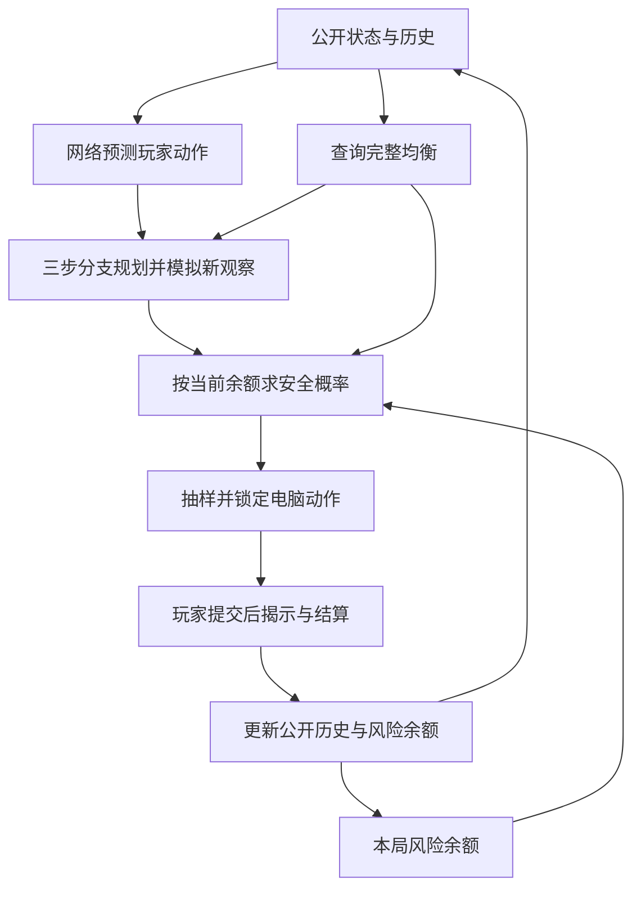

# 西部牛仔电脑策略建模报告：完整一局与快速一轮

> **v0.16.0 更新说明（2026-10-02）**：完整模式现采用 `full-temporal3-belief005-v1`：原行为网络加 814 个贝叶斯行为假设，每次公开观察后回补 0.5% 先验，三步模拟也推进后验，并在浏览器保存恢复。均衡表、网络权重、动态安全余额与快速模式不变。最新发布取舍及验证见 [v0.16.0 发布说明](RELEASE_AI_V0_16.md)。下文保留 v0.15.0 的均衡、网络和快速模式建模推导，其中仅依赖历史输入的完整模式预测器描述属于旧版本。

更新日期：2026-09-27。本文覆盖原建模报告，保留原文件名以兼容已有链接。

依据：网页 v0.15.0 发布代码（提交 `1d11870`）及本地研究记录。2026-09-26 的公网验收已确认完整模式使用 `full-temporal3-credit-v1`；本文说明该发布实现，不另行改变游戏或触发部署。

## 1. 当前网页实际使用什么模型

两种模式都遵循“先估计玩家会怎样行动，再选择有利的应对”的思路，但采用不同实现。完整模式必须联合考虑选弹、筹码结算和剩余轮数，不能简单重复快速模式的轮内策略。

| 项目 | 快速一轮 | 完整一局 |
| --- | --- | --- |
| 任务 | 从双方零子弹开始，赢下这一轮 | 从双方 50 筹码开始，在最多五轮后赢下整局 |
| 基础模型 | 单轮均衡表、折扣最佳响应 | 完整规则下的有限时域均衡 |
| 玩家预测 | 历史频次、均衡先验、上一回合条件统计 | 203 维输入的小型行为预测网络 |
| 决策 | 普通最佳响应混合；有优势时升级为记忆一回合的最佳响应 | 三步前瞻、动态整局风险余额、受约束概率优化 |
| 当前局内适应 | 切换上一回合动作上下文；不重新统计当前局样本 | 每次公开动作后更新历史，下次预测立即使用 |
| 跨局学习 | 下一局从最近完成日志重建模型 | 保留最近 64 条公开事件；网络权重固定 |
| 随机性 | 按最终混合分布抽样，部分局面为纯动作 | 按安全优化所得分布抽样，当前熵温度为 0 |
| 风险控制 | 经验阈值与均衡混合，没有整轮 0.02 保证 | 相对完整均衡的整局最坏期望得分损失上界小于 0.02 |
| 运行位置 | 浏览器 | 服务端 AI worker，浏览器提交操作与显示结果 |
| 神经网络状态 | 做过研究，尚未替换网页策略 | 已用于预测玩家选弹与出招 |

这里的“学习”不等于每次都重新训练网络。快速模式更新统计量；完整模式更新网络输入中的历史信息，网络因此能给出不同预测，但参数不会在对局中改变。

## 2. 游戏规则、目标与记号

令电脑为 C、玩家为 H；当前子弹为 `bc、bh`，筹码为 `mc、mh`，本轮初始选弹为 `pc、ph`。动作编号统一为：0 开枪、1 防御、2 装弹。无子弹时不能开枪，达到子弹上限 10 时不能装弹。

共享规则按以下次序判定：

1. 开枪对装弹触发瞬间胜负，优先于通常的子弹更新与胜负判定。
2. 其余情况中，开枪消耗一发，装弹增加一发；双方同时到 10 为平局，一方至少 5 发且严格多于另一方时获胜。
3. 第 100 回合先按上述规则判胜负，仍未结束才判平局。

研究实验统一报告：

\[
U=\begin{cases}1&电脑胜\\0.5&平局\\0&电脑负\end{cases},
\qquad \mathbb E[U]=P(胜)+0.5P(平).
\]

**平均得分不是纯胜率。** 本文实验胜率以全部对局为分母；网页菜单采用的胜／（胜＋负）统计口径也不能直接与本文平均得分比较。

完整模式直接以整局终局得分为目标。快速模式的实际规划含折扣因子 0.999，因此其价值不是严格的第 100 回合有限时域胜率；具体区别见下一节。

## 3. 快速一轮：统计预测与记忆最佳响应

实现入口：[public/js/ai.js](public/js/ai.js)、[public/js/mode-ai.js](public/js/mode-ai.js)。旧接口中 `b1` 表示玩家、`b2` 表示电脑，与本报告的 C/H 顺序不同。

### 3.1 状态与基础均衡

普通模型只记录双方当前子弹，共 30 个非终局子弹状态。记忆模型再加入上一回合双方动作对，包含“开局”及 9 种动作对，共 300 个增广状态：

\[
s_{quick}=(b_H,b_C),\qquad \widetilde s_{quick}=(b_H,b_C,m).
\]

基础策略来自 [public/strategies.js](public/strategies.js) 中的电脑均衡、玩家均衡和价值表。最佳响应采用平稳折扣模型，折扣因子为 \(\gamma=0.999\)。

这意味着网页规则虽然会在第 100 回合结束游戏，但当前快速 AI 没有把“还剩几回合”放入决策状态，不能称为严格按 100 回合倒推求解。它是已经过实际代码与实验检验的近似策略。

### 3.2 从哪些历史学习

只读取正常完成的快速模式日志，不混入完整模式数据。最多保留最近 90 局，最新一局权重为 1，向前第 k 局权重为：

\[
w_k=0.95^k.
\]

约相隔 13.5 局后，旧局的权重减半。模型按双方子弹差和玩家是否有子弹合并统计：子弹差分为不大于 −3、−2、−1、0、1、2、不小于 3 七档。这样可在相似局面间共享样本，避免每个精确状态都重新积累数据。

代码还使用一项经验性随机检测：某状态有效样本量至少 20，且玩家经验动作分布与合法动作均匀分布的 Jensen–Shannon 散度小于 0.03 时，把这部分统计权重乘以 0.3。这只是降低近似均匀行为的影响，不能证明玩家“真的随机”，也不是对均衡打法的检验。

### 3.3 玩家动作概率

对合法玩家动作 b，先验伪计数为：

\[
\alpha_b=5q_{eq,H}(b\mid s)+1.
\]

将加权历史频次 \(n_b\) 与先验合并：

\[
q_0(b\mid s)=\frac{n_b+\alpha_b}{W+\sum_{b'}\alpha_{b'}},
\qquad W=\sum_b n_b.
\]

均衡先验缓解少样本误判，额外的 1 防止合法动作被赋予零概率。没有历史时，这个平滑预测未必恰好等于玩家均衡分布，但最终电脑行动仍回到电脑均衡策略。

### 3.4 普通最佳响应与均衡混合

把玩家暂时视为按 \(q_0\) 行动，通过价值迭代求电脑最佳响应：

\[
Q(s,a)=\sum_b q_0(b\mid s)
\begin{cases}
U,&本轮结束,\\
\gamma V(s'),&继续游戏.
\end{cases}
\]

迭代最多 20,000 次，最大价值变化小于 \(10^{-7}\) 时提前结束。同时评估电脑坚持基础均衡、面对同一玩家模型的价值。

只有预测的最佳响应优势大于 0.05，才启用利用权重：

\[
\lambda=\frac{W}{W+10},\qquad
p_{base}=(1-\lambda)p_{eq,C}+\lambda\,\mathbf1_{a=a_{BR}}.
\]

优势不足时令 \(\lambda=0\)。样本越多，模型越愿意利用观察到的偏好。这是经验性的信任程度控制，不是严格置信区间。

### 3.5 上一回合记忆与升级机制

为识别“看到电脑上次开枪就防御”等行为，模型估计上一动作对 m 条件下的玩家分布：

\[
q_m(b\mid s,m)=\frac{n_{m,b}+3q_0(b\mid s)}{W_m+3}.
\]

样本少时回退到普通预测；样本增加后，具体反应模式占更大比重。在 300 个增广状态上用策略迭代求解，固定策略的评估通过线性系统：

\[
(I-\gamma P)V=r.
\]

若相关普通统计桶有有效数据，且记忆最佳响应的预测价值比“普通混合策略在同一记忆玩家模型下的价值”高出 0.02，便升级为记忆最佳响应；否则保留普通混合策略。

这里比较的基准是普通混合策略，不是纯均衡。升级后可能采用纯动作，并非始终保留固定比例的均衡随机性。阈值 0.02 表示预测收益门槛，**不代表完整模式使用的 0.02 最坏损失保证**。

### 3.6 何时更新、有哪些边界

每局开始都会重新读取完成日志、构建玩家模型和策略，已修复“必须刷新网页，新日志才生效”的问题。同一局内不会不断把新动作加入统计量或重求整套策略，但会根据最新上一回合动作对切换增广状态，因此能立即采取预先算好的条件应对。

当前电脑动作先抽样并锁定，再等待玩家选择；下一次决策才使用已揭示动作。当前快速模式既没有在线神经网络训练，也没有执行研究目录中的神经候选代码。

主要局限是：对刚刚改变风格的玩家，频次模型要等下一局重建才吸收本局新样本；纯最佳响应也可能被专门反制。它的优势是实现小、决策快，并且在现有普通合成对手上表现较强。

## 4. 完整一局：神经预测、三步规划与动态风险余额

发布策略：`full-temporal3-credit-v1`。实际网页 worker 显式选择 `credit` 策略；不能仅根据研究入口中的默认参数判断线上策略。

### 4.1 状态与终局目标

完整规则状态为：

\[
s=(阶段,轮数,轮内回合数,m_C,m_H,p_C,p_H,b_C,b_H).
\]

玩家预测还使用上一回合动作对、上一轮结果及公开事件历史。筹码保留双方绝对值，不能只保留差额，因为筹码归零会提前结束整局。

完整模型采用折扣因子 1，只在整局结束时返回胜 1、平 0.5、负 0；没有把轮胜、装弹数或筹码差另行加权为奖励。一轮结束后先结算，再进入下一轮选弹。初始选弹与轮内出招都是同时行动，预测器不能读取玩家本次未公开的选择。

### 4.2 赔付为什么会改变轮内风格

双方初始各 50 筹码，每轮选弹范围 0～2，最多五轮。设轮末结算子弹差绝对值为 x，则基础转移额：

\[
y=(p_C+1)(p_H+1)x.
\]

- x 为 0 时不转移筹码。
- 获胜方结算子弹更多时，转移 y；获胜方结算子弹更少时，转移 2y。
- 平局时双方各扣除自己初始选弹数的 5 倍。
- 结算后任一方筹码不大于 0，或第五轮结束，按双方筹码比较整局结果；筹码不会先截断为零。

“劣势双倍”指获胜方的**结算子弹较少**，不是筹码较少。瞬间胜负也要计算结算子弹：开枪方扣一发，被击中的装弹方不增加子弹。

例如第五轮电脑 20 筹码、玩家 80 筹码，双方初始选弹均为 1；当前子弹为电脑 1、玩家 4。若电脑开枪、玩家装弹，结算子弹为 0 和 4，基础赔付为 16，劣势获胜翻倍转移 32，电脑以 52∶48 赢下整局。这个例子说明低子弹获胜也可能很有价值，并不表示电脑能保证玩家配合。

相同当前子弹下，初始选弹决定倍率、当前筹码决定翻盘或提前结束门槛、剩余轮数决定是否还有追赶机会，三者共同改变行动价值。

### 4.3 完整均衡提供可靠的延续价值

离线按有限时域动态规划求解可达状态。终局返回 U，轮末接结算后的下一轮价值，普通出招接下一回合价值。在每个状态构造至多 3×3 的零和矩阵：

\[
Q_{eq}(s,a,b)=
\begin{cases}
U,&整局结束,\\
V_{eq}(s'),&否则,
\end{cases}
\quad
V_{eq}(s)=\max_p\min_b\sum_a p_aQ_{eq}(s,a,b).
\]

先用线性规划建立参照，再用验证过的小矩阵批量求解加速；大型结果存放为磁盘数组，运行时查询和缓存。表文件约 402 MiB，放在服务端，不发送给浏览器。

这套表涵盖完整选弹、结算和回合上限，独立于快速模式旧表。当前记录的累计均衡误差上界为 \(3.868572129306358\times10^{-12}\)，小于最初验收要求的 0.0001。

### 4.4 小型神经网络只预测玩家行为

网络结构：

\[
203\text{ 维输入}\rightarrow96\text{ 个 tanh 隐藏单元}
\rightarrow3\text{ 个动作 logits}\rightarrow合法动作 softmax.
\]

共 19,875 个参数，float64 原始权重 159,000 字节。选弹阶段预测 0、1、2 发，出招阶段预测开枪、防御、装弹，由阶段特征区分。

| 输入部分 | 维数 | 含义 |
| --- | ---: | --- |
| 当前局面 | 19 | 阶段、轮次、回合、双方绝对筹码、初始与当前子弹、上一轮结果、上一动作对、玩家均衡概率 |
| 最近事件 | 88 | 最近 8 条公开事件，每条 11 维 |
| 延迟条件统计 | 96 | 对前 1～4 步的电脑／玩家动作，统计当前玩家动作的条件频率与样本强度 |
| 合计 | 203 | 当前状态与短期行为信息 |

每条事件包含事件存在标识、是否选弹、双方动作 one-hot、轮末／局末标识和轮结果。最近历史最多 64 条；延迟配对统计不跨越轮次边界，避免把上一轮末尾与下一轮开局误当成连续反应。

网络训练使用合成玩家的公开轨迹及合法替代分支，训练集为 832 位合成玩家、75,057 条观测，验证历史为 208 位、18,563 条观测；训练、调参和测试使用独立种子。没有把模拟数据当作真人日志，也不使用快速模式日志训练完整网络。

神经网络的作用是从例子中拟合难以手写的动作依赖、延迟反应和风格变化。它不负责修改规则、决定胜负目标或绕过安全约束；更低的预测误差也不自动等于更高的整局得分。

### 4.5 三步规划如何利用未来观察

每次最多前瞻三次同时决策，选弹也算一次。搜索中对每个动作对执行真实规则，推进子弹、筹码、轮次和记忆，再将模拟公开事件加入历史，重新预测玩家下一手。

若搜索抵达整局终点，直接使用 U；否则在深度末端使用完整均衡延续价值。概念上：

\[
\widehat Q_d(s,H,a)=\sum_bq_\theta(b\mid s,H)
\begin{cases}
U,&整局结束,\\
V_{eq}(s'),&d=1且未结束,\\
\widehat V_{d-1}(s',H';0),&d>1且未结束.
\end{cases}
\]

这里 H′ 是该分支模拟的新历史，分号后的 0 表示后续模拟决策不新增风险额度；实际根节点使用本局当前余额。

因此模型会考虑“这一步之后观察到什么、下次会怎样应对”，但只覆盖三步内。它不是完整信念树的全局最优解，也没有上线最初讨论的 729 个假设的精确贝叶斯后验或贝叶斯蒙特卡洛树搜索。搜索末端回到均衡，可能低估三步以外对弱点的持续利用。

### 4.6 动态整局风险余额与行动随机性

每个新整局从风险余额 \(R_0=0.0199\) 开始。给定搜索得分，当前发布版求解：

\[
\max_p\sum_a p_a\widehat Q_a,
\quad p_a\ge0,\quad\sum_ap_a=1,
\]

并对每个合法玩家动作 b 要求：

\[
\sum_a p_aQ_{eq}(s,a,b)\ge V_{eq}(s)-R.
\]

它会在约束允许的范围内利用玩家弱点。当前温度为 0，没有额外熵奖励；最终仍从所得分布抽样，所以“温度为 0”不等于每次必然采用纯动作。若想增加随机性，需要在同一可行域内重新比较，不能在抽样前随意混入固定比例随机动作。

玩家动作 b 揭示后，余额更新为：

\[
R'=\max\left(0,\ R+\sum_a p_aQ_{eq}(s,a,b)-V_{eq}(s)\right).
\]

记账依据整个已锁定概率分布，而不是电脑这次恰好抽中的动作。玩家的可利用选择可能增加余额，冒险利用可能消耗余额；余额可超过初始值，换轮不重置，新整局才重置。

旧版每一步最多损失 \(0.0199/505\)，容易把可利用空间压得太小。新版允许跨轮累计和使用余额；三步搜索中的后续节点仍按零新增风险求解，没有采用更复杂的未来余额分支规划。

最多五次选弹加 500 次出招，计入每次 \(10^{-10}\) 数值余量与均衡误差：

\[
0.0199+505\times10^{-10}+3.868572129306358\times10^{-12}
=0.019900050503868574<0.02.
\]

这个上界约束的是**相对完整均衡的整局最坏期望得分损失**，不是每局最多输 2% 筹码，也不是保证比针对每位弱玩家的理想最佳响应只差 0.02。具体收益仍取决于玩家预测与搜索质量。

### 4.7 学习生命周期、时限和失败回退

真实动作只在公开后加入历史，并在下一次预测中使用；换轮重置上一回合动作记忆、保留上一轮结果和历史。跨局可保留最近历史，但新局风险余额重新从 0.0199 开始。网络不在线反向传播，没有部署研究中的在线校正器。

余额由服务端会话维护，客户端不能自行增加；重复请求不得重复学习或重复记账。恢复历史记忆并不恢复一场旧残局：新会话从新整局开始，避免用新余额接着玩旧状态。无完整模式历史时，实际行动采用完整均衡。

决策采用约 2.5 秒的软预算和最多 20,000 个搜索节点，先完成较便宜的安全决策，再尝试完整三步规划。预算耗尽时使用已经完成的保底结果；预测无效时回退到均衡；概率优化结果须通过数值安全检查。单次正在执行的计算与文件读取不能被预算立即打断，因此这是尽力遵守的时限，不是严格实时保证。

## 5. 实验结果与取舍

以下均为既有离线实验，不是本文整理时重新进行的真人测试。不同阶段使用的对手与控制器不同，不能把跨阶段分数直接拼成连续进步曲线。置信区间反映对应合成样本的差异，不代表真人总体。

### 5.1 快速模式：网络有局部收益，但尚不足以替换原版

第一轮独立测试中，小网络候选平均得分 0.7912，原版 0.7635，配对差值 0.02770，参考 95% 区间为 [0.00758, 0.04759]。不过固定偏好类型退步，第三局的得分也未超过原版。见首轮结果（本地研究文件：`research/quick_ai/results/REPORT.md`）。

后续加入更严格风险控制、统计与网络组合、未来余额规划。在最后一轮规划实验中，14 类对手、每类 64 位玩家、每人 12 局、四种控制器，共 43,008 局。11 类普通对手上的结果为：

| 策略 | 平均得分 |
| --- | ---: |
| 网页原版 legacy | 0.8719 |
| 动态余额、两步、后续零新增风险 | 0.8214 |
| 动态余额、三步、后续零新增风险 | 0.8209 |
| 三步未来余额规划候选 | 0.8394 |

未来余额规划比旧两步安全候选提高 0.0180，95% 区间 [0.0125, 0.0236]，但仍比网页原版低 0.0326，区间 [−0.0425, −0.0227]。另一方面，专门反制压力组中，原版得分约 0.0872，未来余额候选约 0.4909。该反制者知道电脑概率分布但不知道抽中的动作，不等同于普通真人，也不等同于整轮精确最佳响应。

**当前取舍是保留快速模式原版。** 这不是断言神经网络没有用，而是候选的普通对手收益与反制风险尚未形成更合适的折中；这些候选也同时改变了规划和风险机制，不能把全部差异归因于预测器。详见最终规划实验（本地研究文件：`research/quick_ai/results/PLANNING.md`）。

### 5.2 完整模式：动态余额是已采用的主要改进

第六阶段在 10 类对手、每类 64 位合成玩家、每人连续两局、三个策略上共运行 3,840 局。保持网络不变，比较固定逐步预算、动态余额和未来余额规划：

| 对手范围 | 原固定逐步预算 | 已采用的动态余额 | 未采用的未来余额规划 |
| --- | ---: | ---: | ---: |
| 8 类普通对手平均得分 | 80.71% | 93.16% | 93.70% |
| 2 类压力对手平均得分 | 53.52% | 60.74% | 63.48% |

普通对手上，动态余额比固定预算高 12.45 个百分点，95% 区间 [9.72, 15.04]；未来余额规划比动态余额只高 0.54 个百分点，区间 [−0.73, 1.90]，尚不能确认额外收益。

动态余额在普通组的胜率为 92.68%、平局率 0.98%、负率 6.35%（四舍五入可能使合计略偏离 100%）。这组结果支持采用简单动态余额，但不是“真人胜率 93%”的证明。

两版也改变了模拟后续节点的风险处理，因此不是只改一个预算数字的严格单因素实验。该实验本地平均决策约 2.08 ms、P95 约 3.20 ms；抽样状态在 0.5、1、2.5 秒预算下均完成相同决策。它说明当前三步搜索在测试电脑上足够轻，不保证 Render 的冷启动、并发、网络延迟或手机端运行时间。详见动态余额实验（本地研究文件：`research/match_ai/phase6/REPORT.md`）。

### 5.3 哪些方向暂缓，为什么

| 方向 | 已有发现 | 当前决定 |
| --- | --- | --- |
| 更深的短程模拟 | 所测候选没有带来可靠整体收益，部分落后局面变差 | 不接入 |
| 在线统计校正网络预测 | 某些预测指标和对手类别改善，但未确认整体得分提升 | 不接入 |
| 显式规划未来风险余额 | 完整模式普通组额外收益区间覆盖零，计算更重 | 保留简单动态余额 |
| 额外熵随机化 | 当前发布温度为 0，尚无充分验证支持改为非零 | 保留现有安全分布抽样 |
| 扩大网络或在线训练 | 暂无真人数据证据证明这是主要瓶颈 | 暂不增加部署复杂度 |

更强对手的第九阶段实验共 1,536 局：原神经预测与在线校正总体平均得分均为 62.70%，差值区间 [−3.39, 3.39] 个百分点；更接近可学习行为的四类对手上提高 1.56 个百分点，区间 [−2.64, 5.57]，仍不确定。详见独立验证（本地研究文件：`research/match_ai/phase9/REPORT.md`）。

电脑自对战主要用于发现规则、泄漏和安全问题，不能代替真人目标。两个谨慎策略之间的高平局率，不构成强行降低平局奖励或放松安全约束的理由。后续应优先看人类常见偏好、反应、换风格与被适应后的得分。

这些研究报告中的“未部署”描述的是各自实验完成时的状态。当前采用范围以本报告和 [v0.15 发布说明](RELEASE_AI_V0_15.md) 为准；并非所有研究代码都已接入网页。

### 5.4 已有工程验证

规则模型与共享 JavaScript 游戏引擎做过对照，覆盖正常出招、瞬间胜负、结算子弹、零差、双倍赔付、平局扣款、筹码归零和轮／回合上限等边界。既有完整模式回归包括 3,853 个转移、270 个矩阵和 121 个状态查询。

本次发布前还验证了 363 组状态与余额组合中，生产规划器与研究参照的概率和价值一致；三个完整会话共 15 轮、141 次真实决策的余额与生命周期检查通过。快速模式回归、HTTP 会话和重复请求检查通过，公网验收也确认实际策略标识为 `full-temporal3-credit-v1`。

这些是规则、数学约束与运行链路证据，不能替代真人强度评估。本文仅更新文档，没有重新训练或重跑上述整批实验。

## 6. 当前能力边界与下一步重点

1. **整局模型确实考虑了筹码、赔付与剩余轮数。** 其价值来自完整结算后的终局目标，不是人为给“多一发子弹”固定加分。
2. **两种模式的学习时机不同。** 快速模式每局重建、局内按记忆条件应对；完整模式逐次更新输入历史。尚不能给出对所有真人都成立的“观察 N 次后一定有效”。
3. **未来学习已部分进入规划，但额外收益尚未被单独充分量化。** 三步中会模拟未来观察；动态余额、预测器、搜索深度的实验不能直接证明精确信念规划的独立收益。
4. **随机性服务于得分和防反制。** 当前都有概率抽样，但不保证每个局面都有明显随机。增加熵温度是否提高真人得分，还需要独立验证。
5. **神经网络没有消除全部人为选择。** 状态特征、历史长度、训练对手分布、风险预算与搜索深度仍是设计选择；网络替代的是复杂行为映射，不是目标定义和规则。
6. **下一步最有价值的是验证真人泛化。** 在玩家知情前提下积累包含局／轮边界、决策前公开状态、公开动作和结算的完整模式数据；区分正常完成与中止，按玩家划分训练和测试，避免同一玩家历史泄漏。先分析预测失误与决策失误，再决定是否训练小型尾部价值网络或改进行为预测。

实际产品目标仍是“尽可能提高对真人的整局得分，并保持可接受的反制风险和等待时间”。当前阶段已有可用的两套电脑决策实现；后续应由真实失败案例推动改进，而不是因为模型更复杂就替换现有策略。

## 7. 代码与研究入口

| 内容 | 文件 |
| --- | --- |
| 共享轮内／整局规则 | [game.js](public/js/game.js)、[match.js](public/js/match.js) |
| 快速模式预测、最佳响应、记忆策略 | [ai.js](public/js/ai.js) |
| 快速模式每局重建及界面生命周期 | [mode-ai.js](public/js/mode-ai.js) |
| 快速模式神经候选与后续实验 | 研究说明（本地研究文件：`research/quick_ai/README.md`）、最终规划报告（本地研究文件：`research/quick_ai/results/PLANNING.md`） |
| 完整模式状态转移与事件编码 | [rules.js](lib/match-ai/rules.js) |
| 完整模式网络特征与推理 | [model.js](lib/match-ai/model.js) |
| 当前动态余额规划器 | [credit.js](lib/match-ai/credit.js) |
| 完整模式引擎与网页实际策略选择 | [index.js](lib/match-ai/index.js)、[worker.js](lib/match-ai/worker.js) |
| 完整模式训练与网络选择 | [第五阶段报告](research/match_ai/phase5/results/REPORT.md) |
| 动态余额、短程模拟、在线校正与强对手验证 | 第六阶段（本地研究文件：`research/match_ai/phase6/REPORT.md`）、第七阶段（本地研究文件：`research/match_ai/phase7/REPORT.md`）、第八阶段（本地研究文件：`research/match_ai/phase8/REPORT.md`）、第九阶段（本地研究文件：`research/match_ai/phase9/REPORT.md`） |
| 当前发布范围与验收 | [RELEASE_AI_V0_15.md](RELEASE_AI_V0_15.md) |

版本识别时需区分策略与网络：当前策略为 `full-temporal3-credit-v1`，网络清单及兼容记忆标识仍可保留 `full-temporal3-v1`，因为这次升级改变的是风险规划与会话记账，没有重训原网络。
